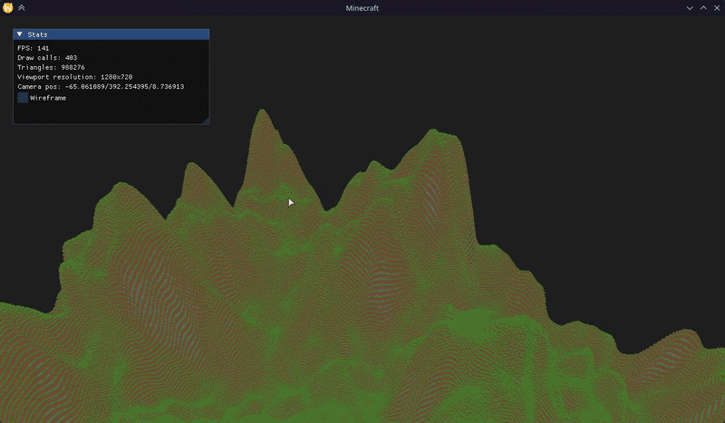
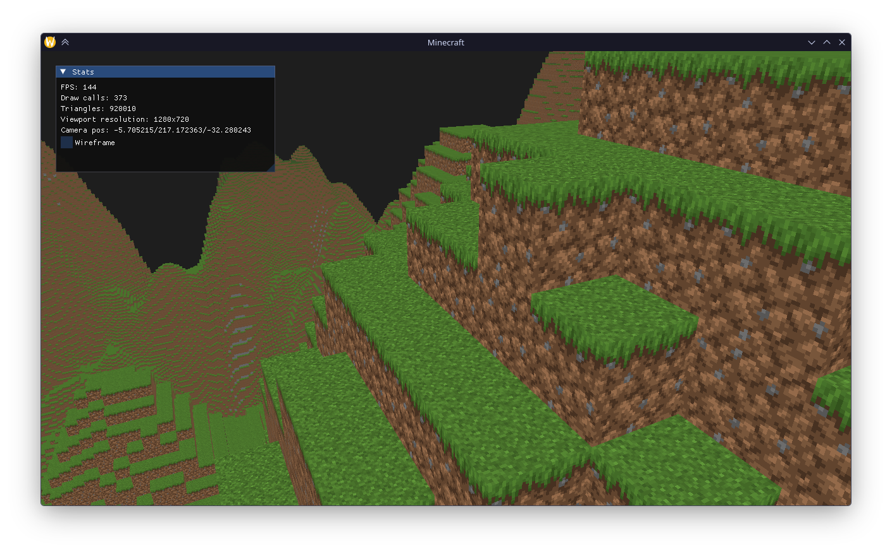
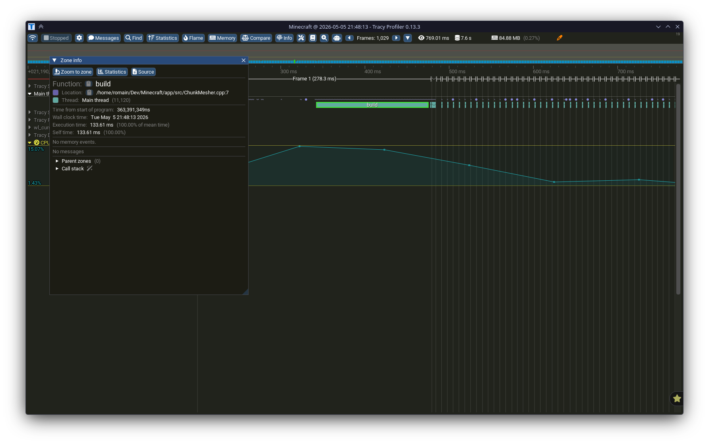
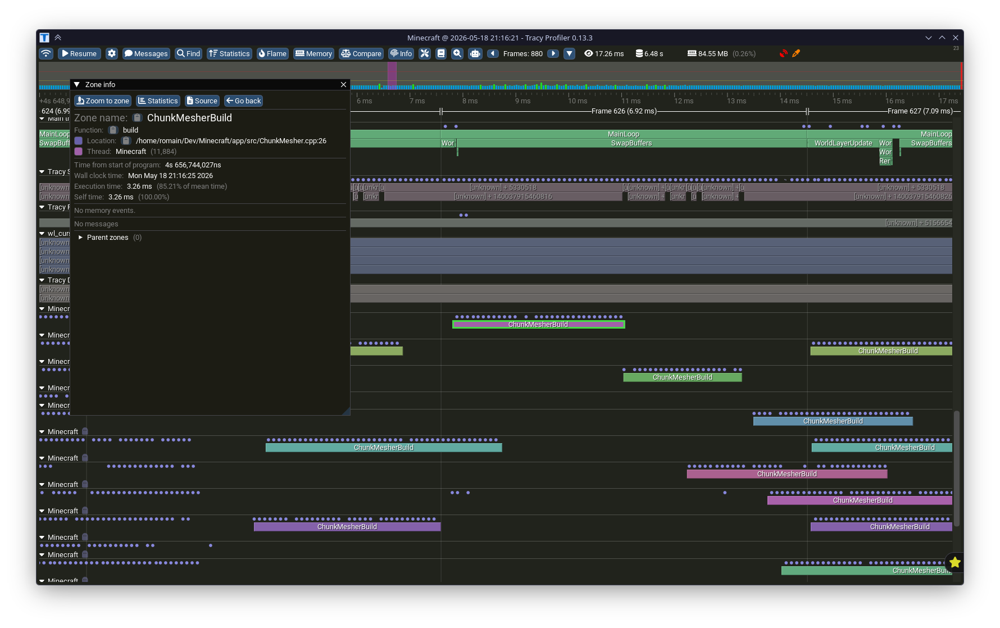
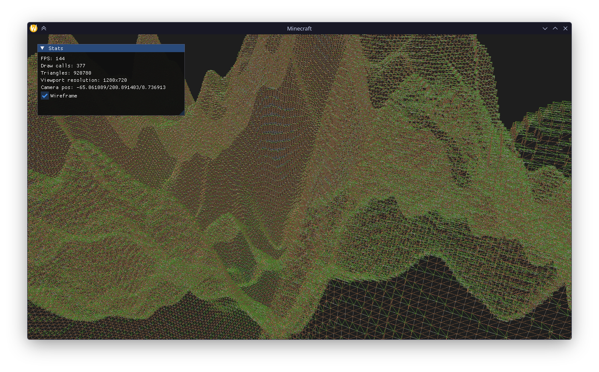
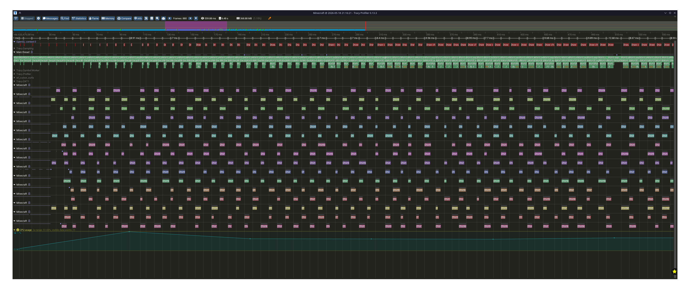

# Minecraft clone

<p align="center">
    
</p>

## Intro
A Minecraft-like voxel engine written in C++20 with OpenGL 4.6.
The goal of this project is not to provide an official version of the engine, but to show you my personal skills and how I progressed through this project.

<p align="center">
    
</p>

## Build the project
### ❗ Requirements
- A compiler compatible with C++20
- An OS and GPU which support OpenGL 4.6 (Linux or Windows, MacOS doesn't support OpenGL since version 4.1)
- CMake > v3.30.0

### 📦 Installation

1. Clone the project:
   ```bash
   git clone https://github.com/RomainPlmg/Minecraft.git
   cd Minecraft
   ```

2. Create a build directory and generate the build files:
    ```bash
    cmake -B build -D TRACY_PROFILER=<ON/OFF> -D CMAKE_BUILD_TYPE=<Debug/Release>
    ```
3. Build the project
    ```bash
    cmake --build build -t Minecraft -j$(nproc)
    ```
4. Run the engine
    ```bash
    ./build/app/Minecraft
    ```

## Technical description
In this part I will try to explain the different technical choices I made and why.

### Memory consumption
First of all, before any rendering, I worked on the memory consumption. Minecraft is a set of chunks, which contains 16\*16\*256 blocks.
With a render distance of 12 for examples, I need to store more than 37 millions of blocks. You can't store all block properties in each of them, because this would exhaust available RAM. We must therefore store our blocks intelligently.  
The solution I've chosen is to make a very simple type registry system. Instead of storing all block properties in each block, I just store the block type (grass, stone, dirt, etc). This can be a simple enumeration based on a uint8:

```c++
enum class BlockType : uint8_t {
    AIR,
    GRASS,
    DIRT,
    STONE,
    COPPER_BLOCK,
    BEDROCK,
};
```

If I want to access block properties (transparent, UVs, affected by gravity, etc.), I create a registry where, for each type of block, I can recover at any moment their properties:

```c++
struct BlockDef {
    std::string name;
    opticrafter::UVRegion top;
    opticrafter::UVRegion side;
    opticrafter::UVRegion bottom;
    bool transparent;
};

class BlockRegistry {
   public:
    void registerBlock(BlockType type, const BlockDef& def);
    const BlockDef& get(BlockType type) const;

   private:
    std::array<BlockDef, 256> m_blocks;
};
```

In the block registry, I've chosen to store my blocks into an array instead of a `std::unordered_map<BlockType, BlockDef>`. This is a choice of memory continuity. `unordered_map` strutures dispatch all the data in the memory. This greatly reduces CPU cache usage, and therefore performances. `std::array`is continuous in memory, which optimizes the CPU's cache usage.

Here on Tracy, with the `unordered_map`, we can see that build a single chunk took more than 130ms...
<p align="center">
    
</p>

With the `array` instead `unordered_map`, I've gone down to less than 4ms:
<p align="center">
    
</p>

### Meshing
For the meshing system, I've done for now a very simple optimization, which is the face culling. The system is very simple: during the chunk meshing, for each block I check the neighbor cube. If this cube is opaque, I don't render the face (since it is invisible).
An example for the front face of a cube:

```cpp
std::optional<BlockType> neighbor = chunk->getBlock(x, y, z + 1); // Here I recover the cube in front of the one I am currently meshing.
if (!neighbor || m_registry.get(*neighbor).transparent) { // If the neighbor cube exists and is opaque, render the front face
    m_builder.addFrontCubeFace(block_pos, block_def.side, ao);
}
```

But there is a little difficulty. Actually this method is only working for the cubes which have their neighbors into the same chunk. But what about the cubes at chunk's boundaries ? I need to recover the neighbor cube into the neighbor chunk. Let's retrieve the front face example for a cube at chunk boundaries:
```cpp
// === Front ===
neighbor = chunk->getBlock(x, y, z + 1);
if (z == Chunk::CHUNK_WIDTH - 1) neighbor = nf->getBlock(x, y, 0); // If the cube is at the front boundary of the chunk, 
                                                                   // recover the neighbor cube into the neighbor chunk
                                                                   // (nf is for neighbor front, calculated before)
if (!neighbor || m_registry.get(*neighbor).transparent)
    m_builder.addFrontCubeFace(block_pos, block_def.side, ao);
```

Then, if a chunk is remeshed during runtime, it is mandatory to mark its neighbors "Invalidated", because if the modified cube is at boundary, the neighbor chun's mesh need to be updated.
One last thing, but to simplify the meshing, the world grid is one chunk greater than the rendered world. This guarantees that a chunk to be meshed will always have a valid neighbor.

<p align="center">
    
</p>

### Multithreading
This part is mandatory for a procedural generation engine. Indeed, if I run the game on only one thread, it will freeze at each chunk generation.
The idea is to send the chunk generation and meshing on worker threads, and display it when it is ready.
So I've created a `ThreadPool` class, in which I can send any task. For example, the chunk constructor:
```cpp
// Fill the new chunks
for (int z = m_oz - bd; z <= m_oz + bd; ++z) {
    for (int x = m_ox - bd; x <= m_ox + bd; ++x) {
        auto& slot = m_chunks.get(x, z);

        // If the chunk does not exists, submit a chunk build task to a thread and recover it's future
        if (!slot || slot->coords().x != x || slot->coords().y != z) {
            m_chunks_to_build.emplace_back(thread_pool.enqueue([x, z] {
                TerrainGenerator generator;
                return std::make_shared<Chunk>(x, z, generator);
            }));
        }
    }
}
```

But that's not the most complicated part. Because actually, individual chunk data don't depend on the other chunks. The other part was the multi threaded meshing. The problem of this part is that, as we saw before, a mesh depends on the neighbor chunks. So when we are (re)generating a chunk mesh, we need to lock the 4 neighbors. So in the `getChunk` function of the grid, we implement a `shared_lock` to lock the grid only for write operations:
```cpp
std::shared_ptr<Chunk> ChunkGrid::getChunk(int cx, int cz) const {
    // Lock any write operation on the grid object, but allow read operations
    std::shared_lock lock(m_mutex);
    return getChunkNoLock(cx, cz);
}
```
In the WorldRenderer, I've created 3 different structures to store the chunks and there meshes:
```cpp
std::set<std::shared_ptr<Chunk>> m_chunks_to_mesh;               // Use set to avoid duplicates
std::set<std::shared_ptr<Chunk>> m_chunks_to_waiting_neighbors;  // Use set to avoid duplicates
std::vector<std::future<MeshData>> m_pending_meshes;
```
When the grid provides new chunks to mesh, I check if it is at world boundary. If it's not, I check if all neighbors are valid. Then if it is the case, there's pushed into the `m_chunks_to_mesh` set or, where applicable, in the `m_chunks_to_waiting_neighbors`.

When iterating on each chunk to mesh (provided by the chunk grid), I build a single chunk mesher per thread and build the mesh:
```cpp
it = m_chunks_to_mesh.begin();
while (it != m_chunks_to_mesh.end()) {
    auto chunk = *it;
    const auto coords = chunk->coords();
    auto nf = grid.getChunk(coords.x, coords.y + 1);
    auto nb = grid.getChunk(coords.x, coords.y - 1);
    auto nr = grid.getChunk(coords.x + 1, coords.y);
    auto nl = grid.getChunk(coords.x - 1, coords.y);

    chunk->setState(ChunkState::Meshing);
    m_pending_meshes.emplace_back(m_engine.threadPool()->enqueue([chunk, nf, nb, nr, nl, this] {
        ChunkMesher mesher(m_registry, m_chunk_grid);
        return mesher.build(chunk, nf, nb, nr, nl);
    }));

    it = m_chunks_to_mesh.erase(it);
}
```

Then, to avoid blocking the main thread, when you enqueue a task in the treadpool, you recover a `std::future`. At each frame, I am looping on the `futures` and check if it is ready. If it's the case, I send the mesh to the GPU and rendering the chunk.
```cpp
auto itv = m_pending_meshes.begin();
while (itv != m_pending_meshes.end()) {
    // Check if the future is ready
    if (itv->wait_for(std::chrono::seconds(0)) == std::future_status::ready) {
        auto mesh = itv->get();

        auto chunk = grid.getChunk(mesh.coords.x, mesh.coords.z);

        if (chunk && chunk->state() == ChunkState::Meshing) {
            const auto coords = chunk->coords();
            m_render_data.set(coords.x, coords.y, m_mesher.uploadToGPU(std::move(mesh)));
            chunk->setState(ChunkState::Meshed);
        }

        itv = m_pending_meshes.erase(itv);
    } else {
        itv++;
    }
}
```

Chunk data is immutable after construction — blocks can't be modified at runtime. This removes the need to lock individual chunks during meshing ; only the grid itself is protected by a `shared_lock` to guard against concurrent reads during chunk insertion.
We can observe worker threads on Tracy:
<p align="center">
    
</p>

## Credits & Assets
This engine uses the Faithful 32x resource pack for its visual components.
- **Credits:** All textures are property of the **Faithful Resource Pack** team.
- **Source:** https://faithfulpack.net/
- **License:** Used under the Faithful License v3. A copy of the original license is included in `./app/assets/textures/LICENSE.txt`
- **Terms:** This is a non-commercial portfolio project; no assets are monetized.
